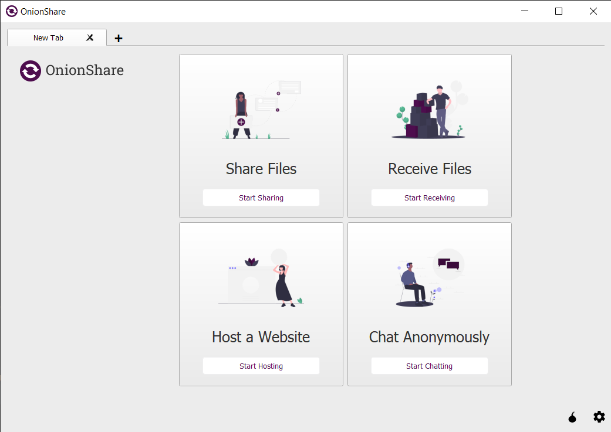
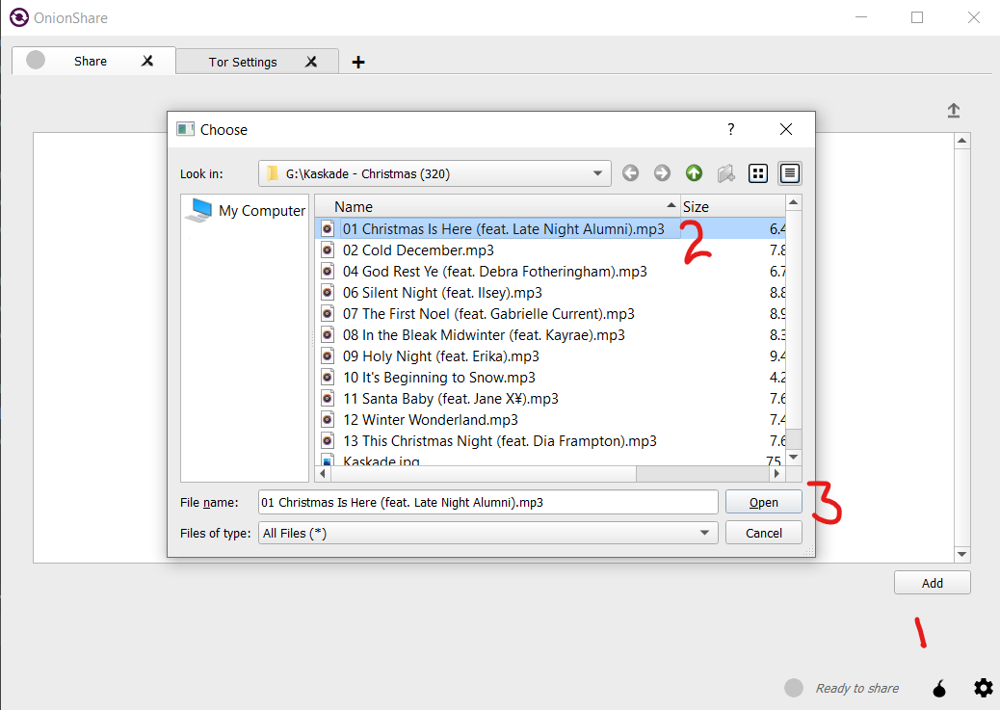
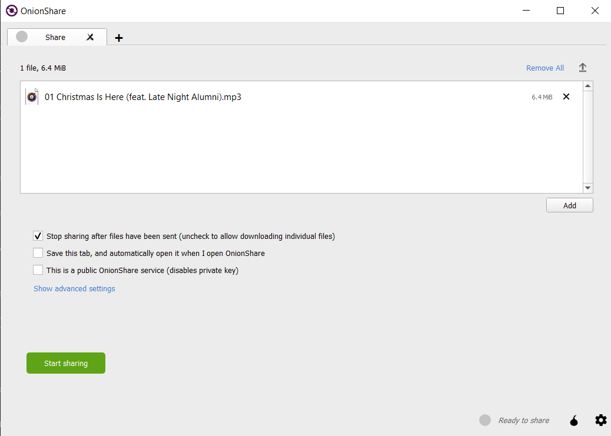
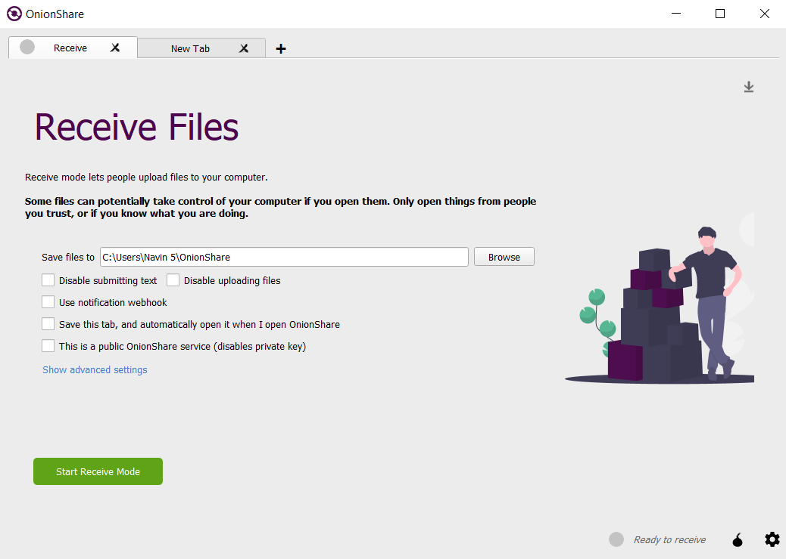
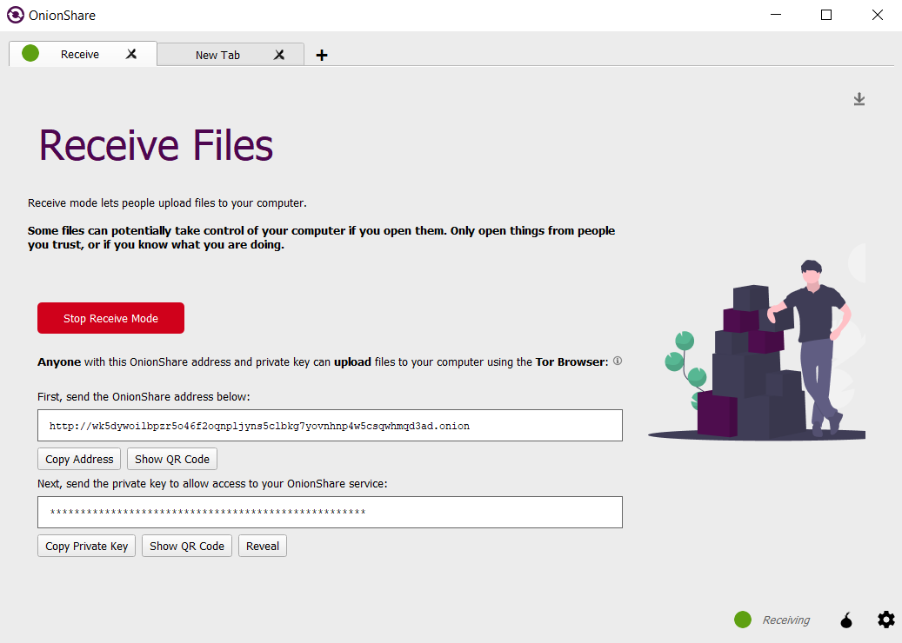
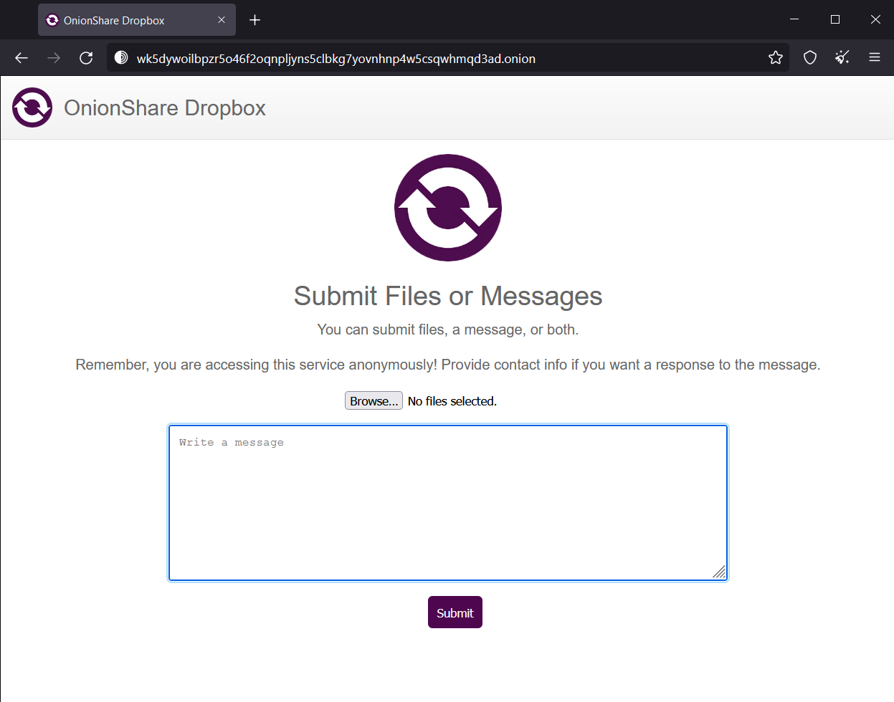

# Introduction

Onion Share is an open source tool which can be used to share or receive files, host a website and communicate with your friends anonymously. You can create temporary meeting rooms to discuss information and the most valuable thing is users don’t require accounts. This tool (Onion Share) uses Tor network to do above things and Tor Onion services to establish web servers locally in your machine. Simply Tor can be called as "The Onion Router" and it is also an open source browser which acts as a barrier and stands to prevent outside access like someone going to see what are you looking for etc. So Tor is really helpful for go through the Internet anonymously. Onion Share web address is protected by default with a random password.

Onion Share 2.2 contains “publish website” as an additional feature to file sharing and receiving. You can easily drag and drop your website’s files into the Onion Share box, then click “start sharing”. Then it will provide you with a.onion URL to host your static website. User can use Tor Browser to view the website without worrying about setting up a server.  

# History 

Technologist Micah Lee who's currently the director of infoSec, developed a simple and user-friendly open source tool called OnionShare, after reading about the trouble journalist Glenn Greenwald had accepting the NSA files from Edward Snowden In August 2013.

And it was released with just a tweet from him.

Lee created the program as a way of sharing big data dumps via a direct channel encrypted and protected by the anonymity software Tor, making it far more difficult for eavesdroppers to determine who is sending what to whom.

Now developers launch the OnionShare new versions ,that allow users to transfer and receive files safely and anonymously, as well as organize the work of a public file-sharing service.  

# Main features

The main feature of OnionShare is to share files directly to the recipient without the requirement of a middleman or third-party server for the data to be hosted on or passed through, and the file share can be executed while remaining completely anonymous on the internet, both sender and recipient. The file-sharing functionality is the primary feature of OnionShare.

OnionShare allows you to share data through OnionShare’s end-to-end encryption that uses Tor’s V3 Onion protocol. Both the sender and receiver will remain anonymous when using OnionShare and there will be no trace left of any file transfers that took place.

With the more recent iterations of OnionShare, there were more features added to its kit. OnionService On-Demand is a service that lets you host a static website accessible through the Tor Browser without requiring you to go through the hassle of setting a server up. Additionally, a handy tool called Ephemeral Chat was included, the feature allows you to create temporary chat rooms protected by OnionShare’s layer of encryption, this feature is particularly useful as it can be used to send the OnionShare URL created when using the file share feature (The URL is to be shared to the recipient to carry out the file transfer.)  

# Advantages

All data sent and received through OnionShare is end-to-end encrypted using Tor’s V3 Onion protocol. This allows you to share and receive data without any fear of your data being breached. Unlike the common email services, cloud services, or any other service that facilitates file sharing, when you use OnionShare your data isn’t accessible by these service’s companies, your data is sent directly from your end to the recipients end with nowhere for the file to be stored in between.

The main advantage of using OnionShare is purely its functionality as a highly secure file sharing tool that allows only the sender and the recipient to have access to the files being shared while remaining Anonymous on the internet and leaving no trace of the file share that occurred. In addition to this, files being sent will be encrypted by OnionShare preventing anyone from spying on the files while they are being shared.  

# Disadvantages

When transferring files, the sender will have to share an Onionshare URL that will provide the recipient with access to the files being sent, this URL must be sent to the recipient. The sender is responsible for securely sharing this URL with the recipient. If they were to send it insecurely through vulnerable methods such as through an email message, there is a risk of the URL being stolen if their email is being monitored by an attacker. If the attacker loads the URL in before the legitimate recipient gets to it, they can download the files being shared.

Because of this, the sender must communicate the Onionshare URL using a more secure method such as a messaging app with encryption or using Tor to create a new anonymous email or chat account and only access it over Tor, to use it for sharing the URL.  

# Pricing

OnionShare is provided under the GNU General Public License, it is an open-source tool available to be downloaded for free. As it is open source, anyone is allowed to collaborate with OnionShare’s team to discuss the project, ask questions and share their ideas.

Developers can contribute code to OnionShare, the source code can be found on this Git repository: [https://github.com/onionshare/onionshare](https://github.com/onionshare/onionshare)  

# Installation guide

OnionShare supports Windows, Linux as well as MacOS. It is available for download in [https://onionshare.org/#download](https://onionshare.org/#download) and the Windows and Mac setups are signed by Micah Lee, the core developer, using his PGP public key with fingerprint 927F419D7EC82C2F149C1BD1403C2657CD994F73.

Step By Step Guide For Windows:

- Go to [https://onionshare.org/#download](https://onionshare.org/#download) and download the OnionShare Windows setup, the .msi file is around 72MB

- Read the OnionShare license agreements and accept the terms to proceed.

- Click the Install button and the Installation may take a few minutes.

- Go to [https://www.torproject.org/download/](https://www.torproject.org/download/) and download the Tor Browser Windows setup

- Read the OnionShare license agreements, accept the terms to proceed and Click the Install button to install. 

  

# How to Use 

## General Setup

1. First of all, we have to run Tor browser and keep it running in the background.

2. Then open OnionShare and wait for it to complete configuration. -Once the configuring is finished it will show the 'New Tab' screen of onionShare

## How to Share Files

1. To share files, click on Share files button and open the share files page.

2. Click on add button and Select the files you need to share.

 
3. In the next screen, you can add more files to share. Furthermore, you can allow public access to the files if necessary. Once the files are finished adding, click on `Start Sharing`

4. Now the files can be accessed via any Tor Browser in the world by using the `onion` address which is displayed in this window

5. Copy the private key and paste it into the alert box that pops up when loading the onion page in Tor.

6. Finally, you can Download the shared files through this page by clicking on `Download Files`

## How to Recieve Files

1. To Recieve files, click on Recieve files button and open the Recieve files page.

2. In the next screen, you can allow public access to send files to you if necessary, and state the location where you need to save the files. Once the setting up is finished , click on `Start Recieving mode`

3. Now, users can send you files via any Tor Browser in the world by using the `onion` address which is displayed in this window

4. Copy the private key and paste it into the alert box that pops up when loading the onion page in Tor.

5. Finally, you can submit the files through this page by clicking on `Browse`

6. The recieved files would be saved in the location which was initially given. 

  
  
#  
 

**Contributors:**

Imran Rasheed [(/dustyrabbit9)](https://github.com/dustyrabbit9) `Lead`

Navin Thamindu [(/navintc)](https://github.com/navintc)

Thedani Dissanayake [(/Thed96)](https://github.com/Thed96)

Yashmi Pokunegoda [(/yashmii)](https://github.com/Yashmii)

Imanthi Abeyrathne [(/Imanthi55)](https://github.com/Imanthi55)

